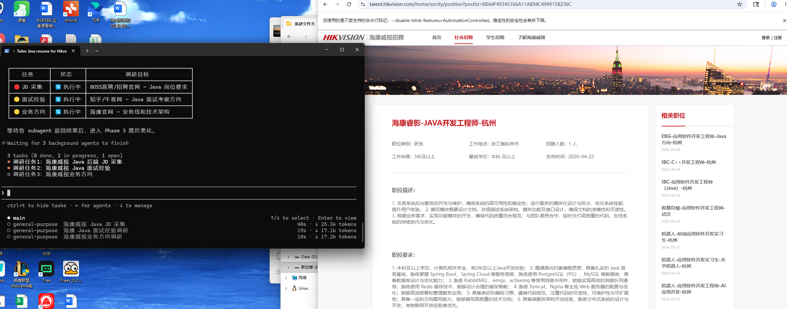
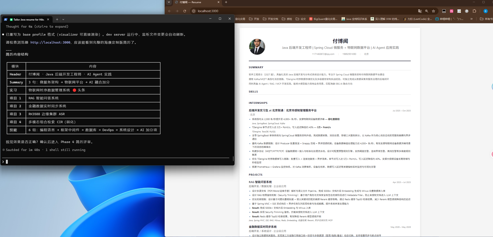
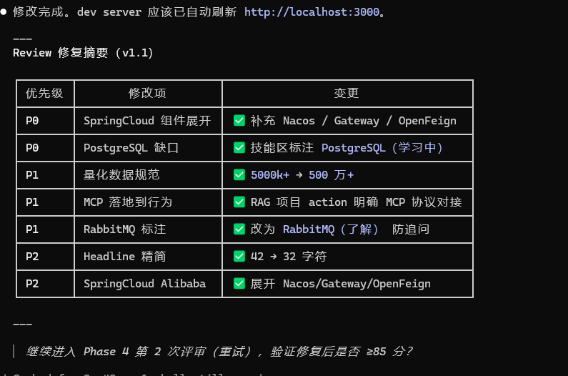
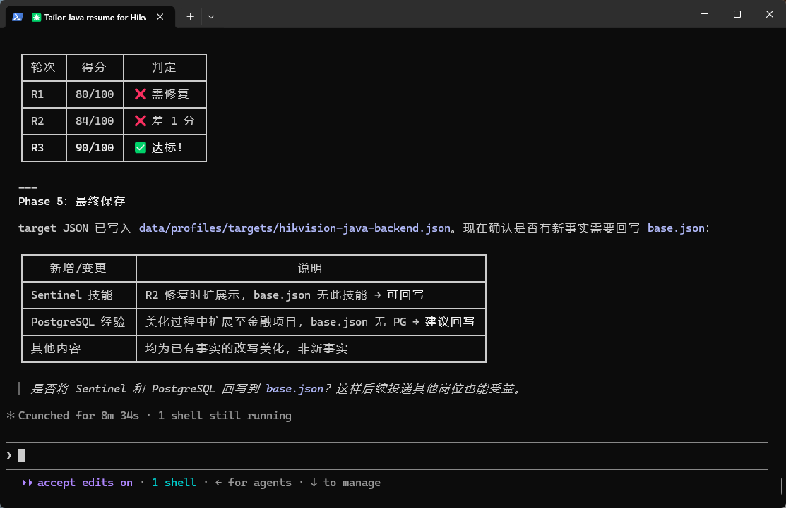

<div align="center">

# SuperResume

**面向 Codex / Claude Code 的证据约束型简历定制插件。**

SuperResume 将简历定制拆成可审计的工作流：目标岗位调研、基础档案维护、岗位定制写作、HTML 实时预览、风险审查和最终保存。

<br>


[项目概览](#项目概览) · [运行截图](#运行截图) · [快速开始](#快速开始) · [工作流](#工作流) · [数据模型](#数据模型) · [开发与验证](#开发与验证)

</div>

---

## 项目概览

SuperResume 适用于这样的场景：用户已经有一份基础简历或经历素材，也有一个目标岗位，但需要 AI 帮助完成调研、定制、预览和复核，并且不能把没有证据的内容写成事实。

它重点解决：

- 调研目标公司、JD、技术栈和面试信号；
- 维护可复用的基础档案，而不是每次从零改简历；
- 基于目标岗位生成投递版简历，同时保留事实追溯；
- 将 JSON 简历渲染为可打印的 HTML 页面；
- 在投递前发现高风险 claim，给出安全表述和面试追问。

核心规则：

```text
事实保存在 base.json。
target 简历只调整表达，不改变事实。
强 claim 必须有证据。
```

## SuperResume 会产出什么

| 输入 | 输出 |
| --- | --- |
| 旧简历、经历笔记、项目描述 | `data/profiles/base.json` |
| 公司、岗位、JD、调研结果 | `data/profiles/targets/<company>-<role>.json` |
| target profile JSON | HTML 实时预览 |
| 评审分数未达标 | 分优先级的修复计划和下一轮输入 |
| 定制过程中确认的新事实 | 可选回写到 `base.json` |

## 运行截图

<table>
  <tr>
    <td width="50%">
      <strong>并行调研 Agent</strong><br>
      <sub>独立浏览器任务采集 JD、面试经验和业务信号。</sub>
      
    </td>
    <td width="50%">
      <strong>实时简历预览</strong><br>
      <sub>target JSON 渲染为可打印 HTML 简历，并支持自动刷新。</sub>
      
    </td>
  </tr>
  <tr>
    <td width="50%">
      <strong>评审修复循环</strong><br>
      <sub>P0/P1/P2 修复项会进入下一轮简历优化。</sub>
      
    </td>
    <td width="50%">
      <strong>最终保存与回写</strong><br>
      <sub>target profile 保存后，可确认是否将新事实回写到 base profile。</sub>
      
    </td>
  </tr>
</table>

## 快速开始

### 1. 安装

```bash
git clone git@github.com:Daydreamer8FuBowen/super-resume.git
claude plugins install ./super-resume
```

用于 Codex 本地开发时，仓库已包含 Patchright MCP 配置：

```toml
[mcp_servers.patchright]
command = "npx"
args = ["patchright-mcp@latest"]
```

### 2. 创建或导入基础档案

```text
/base-profile-editor

这是我的旧简历内容，请写入基础档案。
不要编造经历；缺失信息用 null、空数组或 source_notes 标注。
```

预期输出：

```text
data/profiles/base.json
```

### 3. 运行完整定制流程

```text
/super-resume

目标公司：海康威视
目标岗位：Java 后端开发工程师
JD：如果我没有提供，请先调研。
```

### 4. 预览已有简历

```text
/resume-visual

预览最新 target 简历。
```

内部会先解析正确的 profile 文件：

```bash
node skills/resume-visualizer/scripts/resolve-profile.mjs latest --json
```

## 工作流

```text
基础档案
    |
    v
调研计划 -> 并行浏览器 Agent
    |
    v
定位决策 + target JSON
    |
    v
实时预览
    |
    v
评审 / 修复循环
    |
    v
最终保存 + 可选回写 base
```

| 阶段 | Skill | 职责 |
| --- | --- | --- |
| 1 | `base-profile-editor`, `profile-loader` | 创建或更新事实型基础档案 |
| 2 | `research-launcher` | 规划并执行隔离的浏览器调研任务 |
| 3 | `resume-beautify` | 生成 target profile 和定制内容 |
| 4 | `resume-visual` | 渲染并启动 HTML 预览 |
| 5 | `resume-review` | 评分并暴露高风险 claim |
| 6 | `super-resume` | 编排最终保存和可选回写 |

## 证据边界

SuperResume 在 `fact_traceability` 中使用轻量 Evidence Contract：

| 字段 | 取值 |
| --- | --- |
| `claim_level` | `C0` 了解/参与，`C1` 负责模块，`C2` 设计/优化，`C3` 可度量影响 |
| `truth_status` | `supported`、`careful`、`needs_evidence`、`unsupported`、`unknown` |
| `interview_risk` | `low`、`medium`、`high` |
| `safe_wording` | 当前证据下更安全的表述 |

不安全升级示例：

| 不安全写法 | 更安全写法 |
| --- | --- |
| 本地 demo -> 企业级系统上线 | 完成 demo / 内部验证 |
| 无评测数据 -> 准确率提升 30% | 整理 bad cases / 建立评测口径 |
| 团队项目 -> 独立主导 | 负责某模块 / 参与某阶段 |

## 数据模型

用户简历数据不写入插件内部目录，而是保存在工作项目下：

```text
data/
└── profiles/
    ├── base.json
    └── targets/
        ├── hikvision-java-backend.json
        └── <company>-<role>.json
```

插件实现、模板、文档和测试位于：

```text
skills/
docs/
evals/
tests/
```

`base.json` 是事实源。target profile 可以选择、重排和改写表达，但不应该修改公司、角色、日期、学历、所有权等核心事实。

## 稳定工具链

大型 JSON 不交给 Agent 手写。SuperResume 用小工具处理容易出错的步骤。

### 合并并校验 profile JSON

```bash
node skills/profile-loader/profile-store.mjs merge --profile base --patch patch.json
node skills/profile-loader/profile-store.mjs merge --profile target --id hikvision-java-backend --patch patch.json
```

### 校验 schema

```bash
node skills/profile-loader/validate-profile.mjs data/profiles/base.json --schema base
node skills/profile-loader/validate-profile.mjs data/profiles/targets/hikvision-java-backend.json --schema target
```

### 解析并渲染预览

```bash
node skills/resume-visualizer/scripts/resolve-profile.mjs latest --json
node skills/resume-visualizer/scripts/render-resume.mjs data/profiles/base.json resume-preview.html
```

## Skill 参考

| Skill | 用途 |
| --- | --- |
| `/super-resume` | 主工作流入口 |
| `/base-profile-editor` | 导入、补全或纠正基础简历事实 |
| `/profile-loader` | profile schema、持久化和校验 |
| `/research-launcher` | 公司/JD/岗位调研调度 |
| `/resume-beautify` | 生成岗位定制简历 |
| `/resume-visual` | HTML 预览和自动刷新 |
| `/resume-review` | 评分、claim 风险和下一轮修复建议 |
| `/browser` | 浏览器自动化支持 |

## 仓库结构

```text
SuperResume/
├── .claude-plugin/                 # Claude Code 插件清单
├── .codex/                         # Codex 本地配置
├── hooks/                          # 插件 hooks
├── skills/
│   ├── super-resume/               # 主控工作流
│   ├── base-profile-editor/        # 基础档案导入
│   ├── profile-loader/             # JSON schema 和持久化工具
│   ├── research-launcher/          # 并行调研协议
│   ├── resume-beautify/            # target 简历生成
│   ├── resume-review/              # 评审调度
│   └── resume-visualizer/          # HTML 渲染器和模板
├── docs/
│   ├── assets/                     # README 截图
│   └── superpowers/                # 设计和实现记录
├── evals/                          # 手工回归场景
├── tests/                          # Node 测试
└── README.md
```

## 开发与验证

运行当前自动化测试：

```bash
node --test tests/profile-tools.test.mjs
```

这会验证：

- profile patch 合并不会丢失无关字段；
- target profile 解析会选择最新 target；
- 文档化 target schema 不会被 base-only 字段卡住；
- Evidence Contract 枚举会被校验；
- target profile 能渲染定制内容，而不是空页面。

手工回归场景位于：

```text
evals/manual-eval-suite.md
```

## 路线图

- 增加更多经过打印 QA 的简历模板。
- 为多布局模板增强 target profile 归一化。
- 增加可选 PDF 导出流程。
- 在基础档案导入阶段收集更丰富的证据材料。
- 增加覆盖调研隔离和评审循环的手工 eval。

## 常见问题

### SuperResume 是简历生成器吗？

更准确地说，它是一个简历工作流引擎。它维护事实型基础档案，调研目标岗位，生成定制 profile，预览结果，并审查高风险 claim。

### 它会编造指标或上线影响吗？

不会。影响类 claim 需要证据支持。缺少证据时，内容会被降级，或写入 `safe_wording` 等待补证据。

### 用户数据保存在哪里？

用户简历数据保存在工作项目的 `data/profiles/` 下。插件模板、示例和脚本保存在 `skills/` 下。

### 为什么使用 JSON，而不是直接写 Markdown 或 PDF？

JSON 可以把事实、定制表达、追溯信息和渲染分开。这样后续编辑、预览、评审和回写都更稳定。

## 参与贡献

适合贡献的方向包括：

- 让 skill 更清晰，但不堆叠不必要的提示词；
- 为易错步骤增加确定性工具；
- 增强 profile schema 校验；
- 增加简历模板和渲染测试；
- 增加能抓住不安全简历行为的手工 eval。

请保持本项目的设计倾向：确定性工作交给小工具，判断性工作交给精简 skill，强 claim 必须有明确证据边界。

## License

MIT
