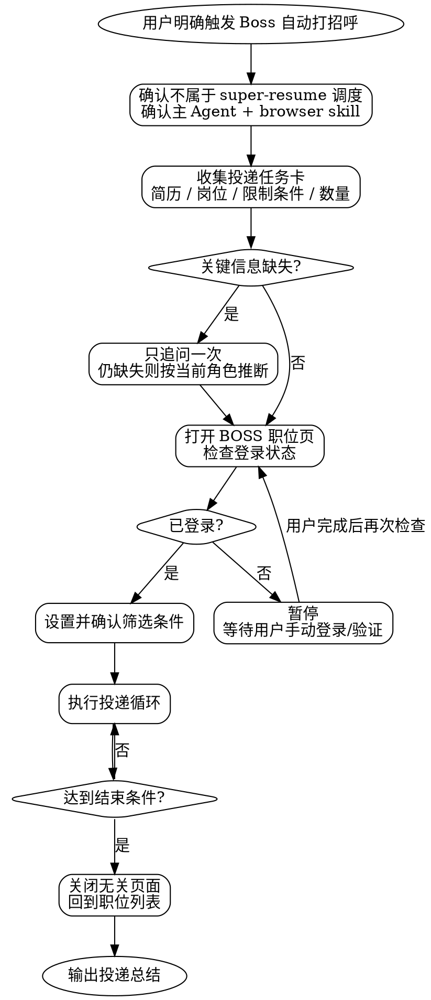
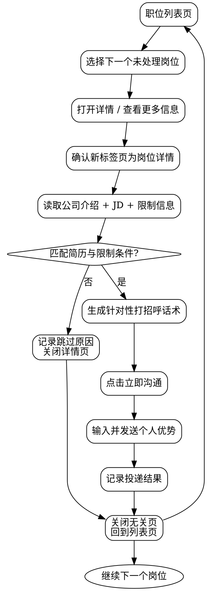

# Boss Auto Greeting

本 skill 用于在 BOSS 直聘中，基于用户指定的简历、目标岗位、岗位限制条件和投递数量，人工可控地完成岗位筛选、公司/JD 阅读、匹配判断、生成打招呼话术并发起沟通。

它是一个 **rigid** 风格的浏览器自动化流程：必须按 checklist 推进，任何登录、验证、风控、人机校验、账号异常或页面状态不确定的场景都要暂停并交给用户处理。

## Trigger Boundary

只在用户明确表达以下意图时使用本 skill：

- “帮我在 BOSS 上自动打招呼”
- “按这份简历投递 BOSS 岗位”
- “打开 BOSS 直聘筛选岗位并自动沟通”
- “根据我的简历给 BOSS 上的岗位发招呼”

不要在以下场景触发：

- 用户只是写简历、改简历、做简历评审或导出简历：使用 `super-resume` 或相关简历 skill。
- 用户只是研究岗位/JD/公司，不需要发起沟通：使用浏览器调研流程。
- 用户没有明确授权在 BOSS 上执行筛选、点击、发送沟通消息。
- subagent 试图调用本 skill。此时必须停止并提示：本 skill 只能由主 Agent 在当前会话中执行。

## Tool Scope

- 只能使用 `browser` skill 提供的浏览器自动化能力。
- 禁止使用 subagent、并行代理或后台代理执行任何 BOSS 页面操作。
- 禁止通过直接 HTTP 请求、接口抓包、绕过页面、模拟验证码或规避平台风控来完成投递。
- 每次点击、输入、切换标签页前，必须确认当前标签页和页面状态。
- 对登录、验证码、短信验证、扫码、App 确认、人机验证、账号异常、平台风险提示，必须暂停自动化并等待用户手动处理。

## Resume Source

用户简历 JSON 保存在当前项目目录下的 `data/profiles/`，不是插件内部的 `skills/` 目录：

```text
<project-root>/
└── data/profiles/
    ├── base.json
    └── targets/
        └── <company>-<role>.json
```

- `data/profiles/base.json` 是事实源，保存用户长期复用的真实经历。
- `data/profiles/targets/<company>-<role>.json` 是面向具体公司/岗位的投递版简历。
- 如果用户明确指定简历文件、`base`、`latest` 或 `target:<slug>`，使用 `node skills/resume-visualizer/scripts/resolve-profile.mjs <input> --json` 解析并校验精确路径。
- 如果用户只说“用我的简历”但没有指定版本，先运行 `node skills/resume-visualizer/scripts/resolve-profile.mjs latest --json`；它会优先选择最新的 `data/profiles/targets/*.json`，没有 target 时回退到 `data/profiles/base.json`。
- 如果 `data/profiles/base.json` 和 target 简历都不存在，停止投递流程，提示用户先通过简历工作流创建基础档案。

## Checklist

按以下 15 项推进。每项完成后再进入下一项；遇到登录、验证、风控或页面不确定状态时暂停。

- [ ] 1. 确认本次请求是用户直接触发，不来自 `super-resume` 内部调度，也不是 subagent 任务。
- [ ] 2. 确认用户授权在 BOSS 页面筛选岗位、点击“立即沟通”并发送打招呼消息。
- [ ] 3. 确认执行范围只使用 `browser` skill，所有页面操作由主 Agent 完成。
- [ ] 4. 确认“使用的简历”；若未指定版本，按 `latest -> base` 规则从项目根目录 `data/profiles/` 解析。
- [ ] 5. 确认“投递的岗位”。
- [ ] 6. 确认“岗位限制条件”，重点包括实习/应届/校招、公司规模、投递地址、薪资、行业偏好和排除项。
- [ ] 7. 确认“投递数量”；用户第一次没有提到时默认 `10`，不追问。
- [ ] 8. 对缺失的简历、岗位、限制条件最多只追问一次；仍缺失则按当前角色和简历保守推断，并写入任务卡。
- [ ] 9. 读取并校验最终简历 JSON，整理“投递任务卡”。
- [ ] 10. 使用浏览器打开 `https://www.zhipin.com/web/geek/jobs`，检查登录状态。
- [ ] 11. 未登录或遇到扫码、验证码、App 确认、人机验证、账号异常时暂停，等待用户手动处理后再次检查。
- [ ] 12. 根据任务卡设置岗位关键词、城市/地址、职位类型、经验、学历、薪资、公司规模、融资阶段等筛选条件。
- [ ] 13. 读取筛选结果和首屏岗位摘要，确认与任务卡一致；最多调整两轮。
- [ ] 14. 对每个候选岗位读取公司介绍和 JD，判断适配后再生成话术并点击“立即沟通”发送。
- [ ] 15. 每次投递后记录结果、关闭本流程打开的无关页面并回到列表页；达到结束条件后输出总结。

## Process Flow

### Overall Flow



### Delivery Flow



## The Process

### 1. 触发与调度边界

本 skill 不属于 `super-resume` 的调度范围。即使用户已经在 SuperResume 工作流中生成过简历，也必须由用户明确表达“使用这份简历去 BOSS 自动打招呼/投递”的意图后才能执行。

如果当前请求来自任何 subagent 或后台任务，立即停止。本流程需要持续读取页面、处理登录状态、判断岗位适配，并在风险节点等待用户，因此必须在主 Agent 中进行。

### 2. 投递任务卡

执行前整理任务卡：

| 字段 | 要求 | 缺失处理 |
|------|------|----------|
| 使用的简历 | 项目根目录 `data/profiles/base.json`、`data/profiles/targets/*.json`、`base`、`latest`、`target:<slug>`、显式路径或用户粘贴文本 | 必须追问一次；用户只说“我的简历”时按 `latest -> base` 解析 |
| 投递的岗位 | 岗位名、关键词或岗位方向 | 必须追问一次 |
| 岗位限制条件 | 实习/应届、公司规模、投递地址等优先，其次薪资、行业、排除项 | 必须追问一次；仍模糊则推断 |
| 投递数量 | 默认 `10` | 用户第一次没说就不追问 |

追问只能发生一次。追问时把缺失项合并成一个问题，不要拆成多轮。用户回复后仍缺失的字段，用当前简历角色和已知目标推断，并明确写入任务卡，例如：

```markdown
投递任务卡
- 简历：`data/profiles/targets/frontend-intern.json`（由 `latest` 解析）
- 岗位：前端开发实习生
- 限制条件：实习/应届优先；城市推断为上海；公司规模不限；排除外包与培训机构
- 投递数量：10
```

读取简历时不要使用插件示例文件（例如 `skills/resume-visualizer/sample-base.json`）。只有项目根目录下的 `data/profiles/` 才是用户真实简历数据目录。

### 3. 登录检查与人工接管

打开 `https://www.zhipin.com/web/geek/jobs` 后先检查登录状态。可通过页面是否显示登录按钮、扫码框、用户头像、职位列表可操作状态、沟通按钮状态等综合判断。

遇到以下情况必须暂停：

- 未登录、登录过期。
- 需要扫码、短信、App 确认、验证码或人机验证。
- 页面显示账号异常、访问频繁、系统繁忙、平台风控。
- “立即沟通”前出现需要用户确认的账号或隐私提示。

暂停时只提示用户完成页面上的人工步骤；用户说已完成后重新检查一次。不要尝试绕过、自动刷新验证码、批量重试或模拟人工验证。

### 4. 筛选条件设置

在职位列表页设置筛选条件时，先从用户提供的任务卡映射到页面筛选项：

- 岗位关键词：输入到搜索框，例如“前端开发实习生”“Java 后端”“产品经理实习”。
- 投递地址：优先使用城市/区域筛选；没有精确区域时使用城市。
- 实习/应届/校招：优先使用职位类型、经验要求、招聘类型筛选；页面无筛选项时在 JD 判断阶段过滤。
- 公司规模：使用规模筛选；用户没有说清楚时按岗位角色推断，例如实习岗位可优先中大型公司，创业公司不过滤。
- 薪资、行业、融资阶段：仅在用户给出限制时设置；不凭空添加强限制。

筛选后必须读取页面当前条件和若干职位摘要。如果页面条件与任务卡冲突，应调整；最多调整两轮。两轮仍不匹配时停止并说明无法稳定筛选。

### 5. 公司与岗位筛选

单个岗位至少检查：

- 岗位名称是否与目标岗位相关。
- JD 是否要求用户明显不具备的硬条件。
- 地点、实习/应届/全职、公司规模是否满足限制。
- 公司业务是否与简历经历有可连接的点。
- 是否存在明显不适合或用户排除的情况，例如培训、外包、长期出差、非目标城市。

跳过时记录简短原因，例如：

| 公司 | 岗位 | 处理 | 原因 |
|------|------|------|------|
| 示例科技 | 前端开发 | 跳过 | 要求 3 年经验，不符合应届/实习限制 |

### 6. 点击与发送

只有岗位判断为适合时才点击“立即沟通”。发送前生成一段短消息，放入输入框后发送。不要发送夸大、虚构经历、隐瞒身份或与简历不一致的内容。

如果“立即沟通”不可用、今日沟通上限、岗位关闭、需要 Boss App 确认或页面弹出限制，则记录失败并返回列表，不要重复强点。

### 7. 页面清理与循环

每完成一个岗位，无论成功、跳过还是失败，都要回到职位列表页。若岗位详情或公司页是本流程打开的新标签页，完成后关闭；不要关闭用户原本存在的标签页。

循环结束条件：

- 成功发送数量达到投递数量。
- 当前筛选结果没有更多可处理岗位。
- 登录失效且用户无法继续处理。
- 平台出现频率限制、沟通上限或风控。
- 用户要求停止。

## Job Conversation Generation

岗位对话生成必须基于三类信息：

1. **个人简历**：真实经历、技能栈、项目、教育背景、可量化成果。
2. **公司业务**：公司介绍、产品方向、行业场景、团队特点。
3. **JD 要求**：技术栈、岗位职责、经验要求、业务能力、软技能。

### 生成原则

- 简短：建议 80-140 字，移动端对话框可读。
- 有针对性：至少命中 1 个公司业务点和 1-2 个 JD 关键词。
- 真实：只使用简历中存在或可合理概括的信息。
- 具体：优先写项目、技术、结果，不写空泛的“学习能力强、认真负责”。
- 自然：语气像求职者本人，不要像营销文案。
- 可发送：不要包含 Markdown、表格、编号、过长标点串或明显 AI 腔。

### 消息结构

```text
您好，我关注到贵司<业务/产品方向>，岗位需要<JD关键词1>/<JD关键词2>。我有<简历中最相关经历>经验，做过<项目/成果/技术栈>，和这个岗位的<匹配点>比较契合。方便的话想进一步沟通一下，谢谢。
```

### 示例

**输入摘要**

- 简历：前端实习候选人，React、TypeScript、低代码配置平台项目，做过性能优化。
- 公司：企业协同 SaaS。
- JD：React、组件库、复杂表单、工程化。

**推荐话术**

```text
您好，我看到贵司主要做企业协同 SaaS，这个岗位关注 React、组件库和复杂表单。我有 React/TypeScript 项目经验，做过低代码配置平台和页面性能优化，和岗位的工程化与业务配置场景比较匹配。方便的话想进一步沟通一下，谢谢。
```

**反例**

```text
您好，我非常优秀，学习能力很强，什么都能做，希望给我一个机会。
```

问题：没有公司业务、没有 JD 关键词、没有简历证据，可信度低。

### 发送前自检

- 是否出现了简历里不存在的经历、数字、公司名或学历。
- 是否命中了该岗位的真实 JD，而不是套模板。
- 是否过长，导致对话框里阅读困难。
- 是否包含敏感或不必要信息，例如身份证、手机号、家庭住址。

## Key Principles

### 1. 用户意图优先

本 skill 只做用户明确授权的 BOSS 自动沟通任务。不要替用户扩大范围，不要自动切换到其他招聘平台，不要把简历优化流程和投递流程混在一起。

### 2. 浏览器主 Agent 单线执行

BOSS 页面操作必须在当前主 Agent 中完成。登录状态、页面跳转、弹窗、风控和沟通结果都需要即时判断，不能交给 subagent 或后台流程。

### 3. 一次追问原则

缺失“简历、岗位、限制条件”时只追问一次；投递数量未给出则默认 10。追问后仍模糊的岗位限制条件，要根据当前角色进行保守推断，并把推断写给用户看。

### 4. 人工验证不可绕过

登录、验证码、扫码、App 确认、人机验证和平台风控都由用户处理。自动化只在正常登录态、正常页面态下继续。

### 5. 先读后点

不要看到岗位标题就直接沟通。每个岗位必须先读取公司介绍和 JD，再判断匹配度，然后生成针对性话术。

### 6. 真实且克制

打招呼消息是求职沟通，不是包装夸大。只使用简历与 JD 能支撑的信息，宁可简短，也不要虚构。

### 7. 可审计记录

每次成功、跳过、失败都要记录。最终总结要让用户知道投递到了哪些公司、为什么跳过某些岗位，以及哪里被平台或页面状态阻塞。

## Final Report

流程结束后，用以下格式输出：

```markdown
## Boss 自动打招呼完成

任务卡：
- 简历：<resume>
- 岗位：<role>
- 限制条件：<constraints>
- 目标投递数量：<count>

结果：
| 状态 | 数量 |
|------|------|
| 已发送 | <n> |
| 已跳过 | <n> |
| 失败/受限 | <n> |

明细：
| 公司 | 岗位 | 状态 | 说明 |
|------|------|------|------|
| <company> | <job> | 已发送 | <message summary> |

中断或限制：
- <如果没有，写“无”>
```
