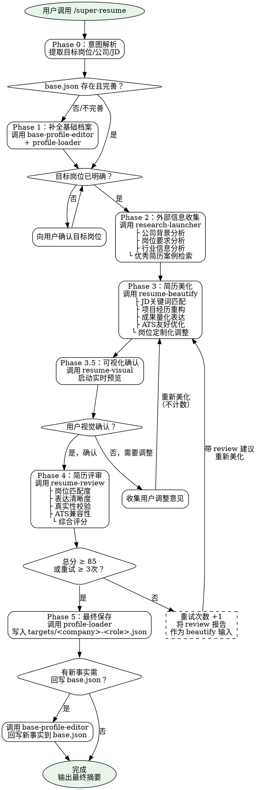

# SuperResume

本技能是 SuperResume 插件的主控技能，管理简历编写的完整生命周期。它是唯一入口——用户始终通过 `/super-resume` 启动工作流，子技能由本技能内部调度。

## When to Use

| 触发 | 不触发 |
|------|--------|
| 用户说"帮我写简历/优化简历/投递XX岗位" | 子技能独立调用（research-launcher 等由本 skill 内部调度） |
| 用户输入 `/super-resume` | 用户只想预览（直接用 `/resume-visual`） |
| 任何简历创建/定制的完整工作流请求 | 用户只想编辑基础信息（直接用 `base-profile-editor`） |

## Subagent 限制

**本 skill 不得由 subagent 调度。** 子技能通过 `Skill` tool 直接调用，不使用 subagent 间接调度子技能。如果检测到当前由 subagent 执行，立即停止并提示用户直接调用。

## Checklist

> 每个阶段必须在进入下一阶段前完成所有检查项。这是 rigid 风格的强制清单。

### Phase 0: Intent Parsing
- [ ] 确认本 skill 由用户直接调用（非 subagent）
- [ ] 提取用户意图：目标岗位（必须）、目标公司（可选）、JD（可选）

### Phase 1: Base Profile Ready
- [ ] 检查 `data/profiles/base.json` 是否存在
- [ ] 若不存在或信息不完整 → 调用 `base-profile-editor` + `profile-loader` 补全
- [ ] 确认至少存在：姓名、联系方式、至少一段工作/项目经历
- [ ] 确认目标岗位名称已明确

### Phase 2: External Research
- [ ] 调用 `research-launcher` 执行完整调研工作流（并行隔离 browser subagents）
- [ ] 确认获得：JD 分析结果（或用户提供 JD）、公司/行业背景（至少部分）
- [ ] 调研结果已整理为结构化输出

### Phase 3: Resume Beautification
- [ ] 调用 `resume-beautify` 生成目标简历
- [ ] 确认 `data/profiles/targets/<company>-<role>.json` 已通过 `profile-store.mjs` 写入并校验
- [ ] 调用 `resume-visual`，先用 `resolve-profile.mjs` 解析正确 JSON，再启动预览
- [ ] 用户确认视觉效果（调整不限次数，每次调整后重新 beautify → visual）

### Phase 4: Resume Review
- [ ] 用户视觉确认通过后，调用 `resume-review` 评分
- [ ] 若总分 < 85 且重试次数 < 3：回到 Phase 3，将 review 报告传给 beautify
- [ ] 若总分 ≥ 85 或重试次数 = 3：进入最终输出

### Phase 5: Final Save
- [ ] 调用 `profile-loader` 写入最终 `targets/<company>-<role>.json`
- [ ] 如果优化过程中产生了新事实信息，确认是否回写 `base.json`
- [ ] 输出最终摘要：岗位匹配度、关键亮点、简历文件路径

## Process Flow



### Flow Key Points

| 节点 | 说明 |
|------|------|
| `check_base` | 分支点：档案就绪直接进入目标确认，否则先补全 |
| `user_ok_visual` | 循环点：用户调整不计数，可无限迭代 |
| `score_check` | 守卫：评分 ≥85 或重试 ≥3 次才放行到最终保存 |
| `retry_count` | 计数器：每次 review 不通过 +1，上限 3 次 |

## The Process

### Phase 0：意图解析

| 属性 | 内容 |
|------|------|
| **职责** | 从用户输入中提取工作流启动参数 |
| **输入** | 用户自然语言（如"帮我写一份投递字节前端的简历"） |
| **输出** | 结构化目标：`{target_role, target_company?, target_jd?}` |
| **规则** | 至少提取岗位名称。JD 可后续补充。公司可选。提取不到则直接提问 |

### Phase 1：基础档案就绪

| 属性 | 内容 |
|------|------|
| **职责** | 确保 `data/profiles/base.json` 存在且包含足够信息支撑后续美化 |
| **调用** | `Skill` tool → `profile-loader`（读取）、`base-profile-editor`（补全） |
| **就绪标准** | 至少存在：姓名 + 联系方式 + 至少一段工作/项目经历 |
| **不满足时** | 启动 `base-profile-editor` 的 intake 流程：导入旧简历、逐项补全、冲突确认 |
| **完成后** | 确认目标岗位已明确，缺失则提问 |

### Phase 2：外部信息收集

| 属性 | 内容 |
|------|------|
| **职责** | 收集目标公司/岗位/行业的背景信息，为美化提供 JD 锚点 |
| **调用** | `Skill` tool → `research-launcher`（完整 5 阶段调研流程；执行阶段使用并行、独立标签页的 browser subagents） |
| **产出** | 岗位核心要求、公司技术方向、行业关键词、简历关注重点 |
| **调度方式** | 直接调用 `Skill` tool 执行 `research-launcher`；research-launcher 内部可并行调度隔离 browser subagents |
| **容错** | 部分信息获取不到是正常的，标记状态后继续，不强求完整 |

### Phase 3：简历美化

| 属性 | 内容 |
|------|------|
| **职责** | 基于 base.json + JD + 调研结果，生成针对目标岗位的美化简历 |
| **调用** | `Skill` tool → `resume-beautify`（完整 5 阶段美化流程） |
| **产出** | 通过 `profile-store.mjs` 写入并校验的 `data/profiles/targets/<company>-<role>.json`、定位决策摘要 |
| **循环支持** | 可接收用户调整意见或 review 报告作为额外输入，重新执行美化 |
| **约束** | 不修改 base.json、核心事实不可变、所有 claim 可追溯、扩展项标注 confidence |
| **调度方式** | 直接调用 `Skill` tool |

### Phase 3.5：可视化确认

| 属性 | 内容 |
|------|------|
| **职责** | 将美化后的 target JSON 渲染为 HTML 页面，供用户实时预览 |
| **调用** | `Skill` tool → `resume-visual`（先用 `resolve-profile.mjs` 解析并校验 profile，再启动 dev server + 浏览器预览） |
| **确认标准** | 用户明确表示"没问题"/"可以"/"继续" |
| **调整处理** | 收集反馈 → 回到 Phase 3（不计数），调整后重新可视化 |
| **头像提醒** | 可视化启动时自动检测 `profile.png`，提醒用户可放置简历头像（非强制） |

### Phase 4：简历评审

| 属性 | 内容 |
|------|------|
| **职责** | 对美化后的简历进行 5 维度结构化评审和打分 |
| **调用** | `Skill` tool → `resume-review`（构建 subagent 上下文 + 启动 reviewer subagent） |
| **评分维度** | 岗位匹配度、表达清晰度、真实性校验、ATS 兼容性、综合评分 |
| **阈值逻辑** | 总分 ≥ 85 → 通过；< 85 且重试 < 3 → 回到 Phase 3；≥ 3 次 → 强制通过 |
| **调度方式** | 直接调用 `Skill` tool 执行 `resume-review` |

### Phase 5：最终保存

| 属性 | 内容 |
|------|------|
| **职责** | 将最终确认的简历持久化，可选回写新事实到 base.json |
| **调用** | `Skill` tool → `profile-loader`（通过 `profile-store.mjs` 写入 `targets/<company>-<role>.json`）；如有新事实 → `base-profile-editor`（回写 `base.json`） |
| **回写判断** | 优化过程中用户补充了 base.json 中原本没有的事实（而非改写），则确认是否回写 |

### Phase 6：完成

| 属性 | 内容 |
|------|------|
| **职责** | 输出最终摘要，告知用户简历位置和关键信息 |
| **输出** | 目标岗位、匹配度评估、简历文件路径、关键亮点提示 |

## Key Principles

### 1. 单一入口原则
`/super-resume` 是简历编写的唯一入口。所有子技能（research-launcher、resume-beautify、resume-review、resume-visual、profile-loader、base-profile-editor）由本技能内部调度，用户不直接调用子技能。Subagent 不得调度本 skill。

### 2. 核心事实不可变 + 任务细节可扩展原则
公司名、角色、在职时间、学历——这些核心身份事实不可改变，必须可追溯到 `base.json`。
在此框架内，基于 JD 要求 + 公司业务 + 行业常识，可以对项目任务细节进行**适度扩展**。
扩展必须满足：有逻辑推导链、不违反已有事实、扩展部分在 `fact_traceability` 中标注 confidence 级别。
无依据的量化数据不编造——标注缺失并建议用户补充。

### 3. JD 锚定原则
所有定位决策（项目排序、技能取舍、Headline 撰写、bullet 改写方向）必须能从 JD 中找到依据。没有 JD 时以岗位名称为最小信号，标注不确定性。

### 4. 用户确权原则
以下节点必须获得用户明确确认才能继续：
- 调研计划执行前（research-launcher Phase 3）
- 可视化预览后（决定进入 review 还是继续调整）
- 新事实回写 base.json 前

自动化决策（定位、美化、评分）不需要逐项确认，但决策摘要需要呈现。

### 5. 渐进式不重来原则
不追求一步到位。base.json 不完善先补全，JD 缺失先调研，review 不通过再优化。每个阶段只做该阶段的事，不跳步，不回退到更早阶段（除了设计内的循环）。

### 6. 循环上限原则
两个循环各有边界：
- **用户调整循环**：不限次数，每次调整后 beautify → visual
- **Review 重试循环**：最多 3 次，第 3 次后无论分数多少都强制进入最终保存

### 7. 污染隔离原则
`base.json` 是事实源，target JSON 是投递版。美化过程只写 target，不污染 base。只有在用户确认补充了真正的新事实（而非改写）时，才回写 `base.json`。

### 8. 容错继续原则
调研不完整、JD 模糊、部分信息缺失都不阻塞流程。标注清楚状态后继续，让用户在后续节点看到并决定。

## Final Output

工作流完成后，向用户呈现结构化摘要：

```markdown
## SuperResume 工作流完成

**目标岗位：** <company> - <role>
**简历文件：** `data/profiles/targets/<company>-<role>.json`

### 匹配度评估
| 维度 | 评分 | 说明 |
|------|------|------|
| 岗位匹配度 | XX/100 | <一句话> |
| 表达清晰度 | XX/100 | <一句话> |
| 真实性 | XX/100 | <一句话> |
| ATS 兼容性 | XX/100 | <一句话> |
| **综合** | **XX/100** | <一句话> |

### 关键亮点
- <亮点 1>
- <亮点 2>
- <亮点 3>

### 定位决策回顾
- 项目排序：<Top 3>
- 技能突出：<highlighted skills>
- 内容操作：保留 X 项 / 合并 X 项 / 移除 X 项

### 循环统计
- 用户调整次数：X 次
- Review 重试次数：X 次

### 下一步
- 预览简历：`/resume-visual`
- 导出 PDF：浏览器打开预览页 → Ctrl+P → 另存为 PDF
- 投递其他岗位：`/super-resume` 重新开始
```

## Resume Management

### 路径约定

| 位置 | 目录 | 用途 |
|------|------|------|
| **用户简历数据** | `data/profiles/`（项目根目录） | 用户的真实简历 JSON——事实源与投递版本 |
| **插件数据** | `skills/resume-visualizer/`（插件目录） | 模板元数据、示例数据——仅供 visualizer 自身运行 |

> 用户简历 JSON 始终存放在项目目录的 `data/profiles/` 下，不与插件目录混淆。可视化的模板和示例文件位于插件目录中。

### 文件结构

```
<项目根目录>/
└── data/profiles/
    ├── base.json                          ← 事实源（唯一真相）
    └── targets/
        ├── bytedance-frontend.json         ← 字节跳动-前端
        ├── tencent-backend.json            ← 腾讯-后端
        └── ...                             ← 每个岗位一个文件

<插件目录>/skills/resume-visualizer/
├── sample-base.json                       ← 示例数据（仅供测试）
└── templates/
    └── <template-name>/
        ├── template.json                   ← 模板元数据
        └── ...
```

### 管理操作

| 操作 | 说明 |
|------|------|
| 查看所有版本 | 列出 `targets/` 目录下所有 JSON 文件 |
| 查看特定版本 | 通过 `profile-loader` 读取对应 target JSON |
| 可视化任意版本 | `resume-visual` 指定 target JSON 路径 |
| 基于旧版本微调 | 加载已有 target JSON 作为起点，修改后重新美化 |

### 可视化集成

`resume-visual` 在 Phase 3.5 被调用后：
- 启动本地 dev server（默认 `http://localhost:3000`，端口占用自动递增）
- 自动打开浏览器预览
- 修改 target JSON 后自动刷新
- 用户可通过浏览器 Ctrl+P 导出 PDF

## Error Handling

| 场景 | 处理 |
|------|------|
| `base.json` 不存在 | 停止。提示用户通过 `base-profile-editor` 创建基础档案 |
| `base.json` 存在但几乎为空 | 警告用户，继续执行但标注结果会很薄 |
| 用户未提供目标岗位 | 停止。至少需要岗位名称才能继续 |
| `research-launcher` 无结果返回 | 标记为"未获取到调研结果"，用已有 JD/岗位信息继续 |
| `resume-beautify` 失败（无 JD、空 base） | 停止。报告缺失的前置条件，请用户补充 |
| `resume-visual` 端口被占用 | visualizer 自动递增端口号，报告实际 URL |
| `resume-review` subagent 失败 | 重试一次。若仍失败，跳过 review 并标注后进入最终保存 |
| target 文件已存在 | 询问用户：覆盖 / 创建带日期版本 / 取消 |
| Review 分数 3 次后仍 < 85 | 强制通过。在最终摘要中标注"3 次评审未达阈值，强制输出" |
| 工作流中用户尝试直接调用子技能 | 提醒用户：子技能由 super-resume 统一管理，请使用 `/super-resume` |

## Anti-Patterns

| 禁止 | 正确做法 |
|------|----------|
| Subagent 调度本 skill | 用户直接调用；子技能通过 `Skill` tool 调度 |
| 美化过程中修改 `base.json` | 始终只写 `targets/` |
| 跳过可视化确认直接进入 review | 必须获得用户视觉确认后才能进入评审 |
| 编造指标、日期、经历 | 标注缺失，建议用户补充 |
| 绕过 review 循环 | 视觉确认后必须执行评审 |
| 无限优化（超过 3 次 review 重试） | 3 次后强制进入最终保存 |
| 用 subagent 调度子技能 | 始终用 `Skill` tool 直接调用子技能 |
| 跳过 checklist 中的阶段 | 每个阶段必须完成后才能进入下一阶段 |
| 允许用户在工作流中独立调用子技能 | 提醒用户完整工作流由 super-resume 管理 |

## Integration Contract

### 子技能调度表

| Phase | 子技能 | 调度工具 |
|-------|--------|----------|
| 1 | `profile-loader` | `Skill` tool |
| 1 | `base-profile-editor` | `Skill` tool |
| 2 | `research-launcher` | `Skill` tool |
| 3 | `resume-beautify` | `Skill` tool |
| 3.5 | `resume-visual` | `Skill` tool + Bash（node 脚本） |
| 4 | `resume-review` | `Skill` tool |
| 5 | `profile-loader` | `Skill` tool |
| 5 | `base-profile-editor`（回填） | `Skill` tool |

### 数据流

```
base.json ──→ research-launcher ──→ 调研结果
                  │                      │
                  ▼                      ▼
            resume-beautify ←── JD / 调研 / 用户约束
                  │
                  ▼
         targets/<company>-<role>.json
                  │
          ┌───────┼────────┐
          ▼       ▼        ▼
    resume-visual  resume-review  profile-loader（最终保存）
                         │
                         ▼
                  review 报告 ──→ resume-beautify（重试时）
```
